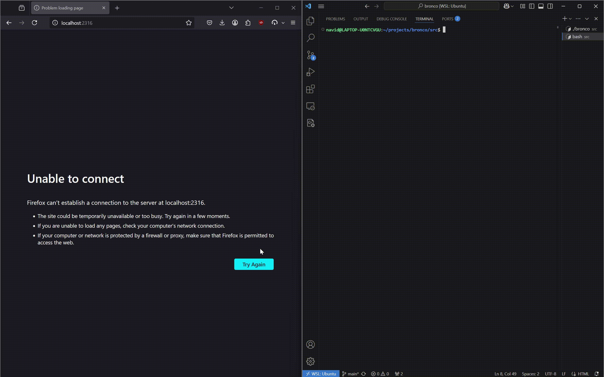

# Bronco: Lightweight Web Server

Bronco is a lightweight web server written in C.

## Demo

## How it works

Bronco uses sockets to create a TCP server and implements a subset of HTTP/1.1.

- A socket is bound to the server port (8080 by default unless otherwise specified) and listens for incoming connections
- Incoming connections are handed off to threads taken from the thread pool allowing for concurrent connections

## How to use it

Bronco serves files stored in the `www` directory. Any file added there will be accessible.

### Prerequisites

- Unix system

### Running the application

1. Navigate to the `src` directory
2. Run `make` 
3. Run `./bronco [port number]`
